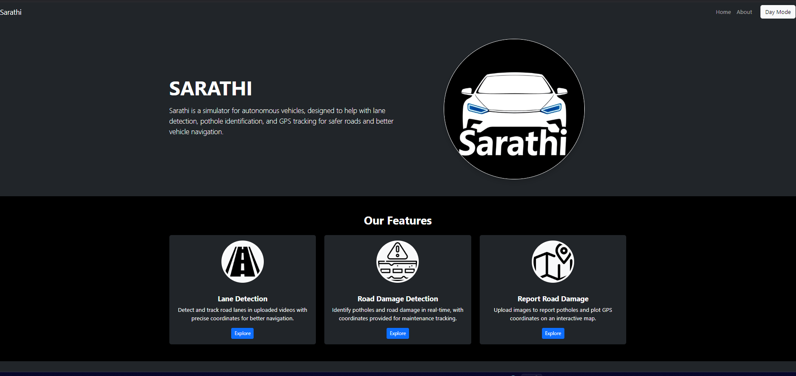
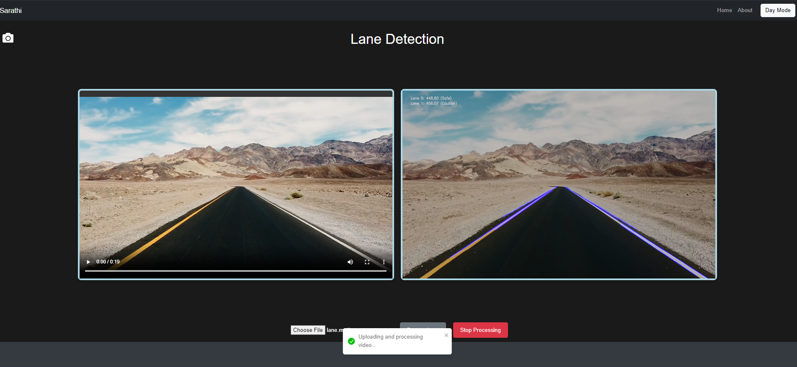
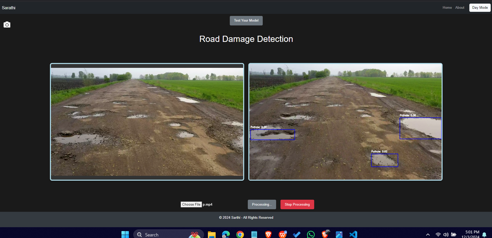
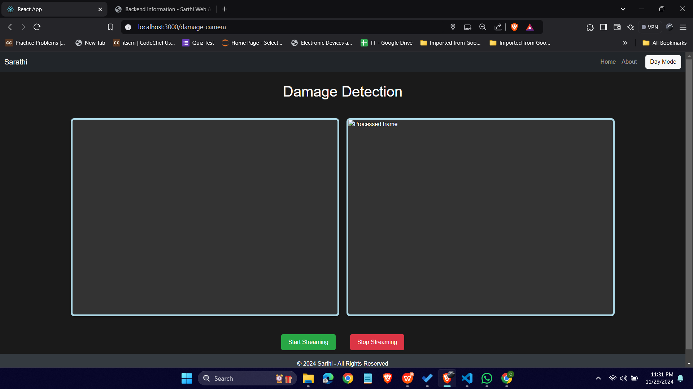
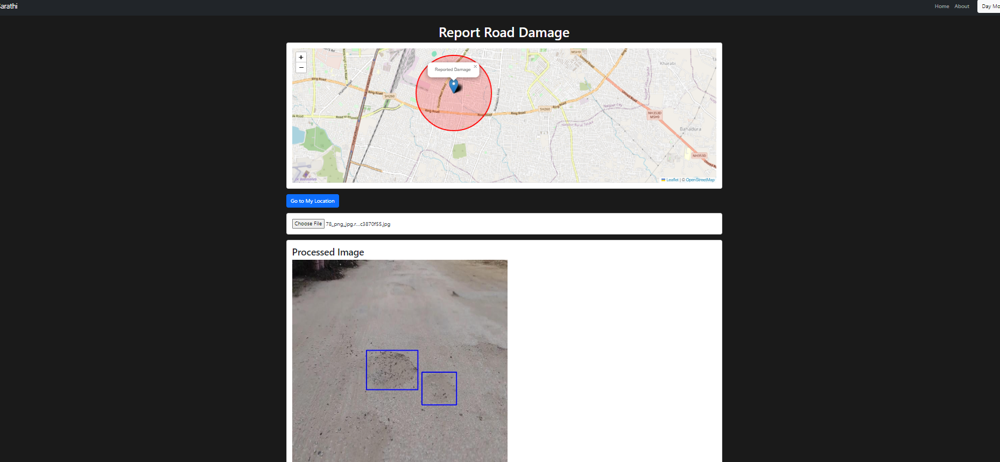
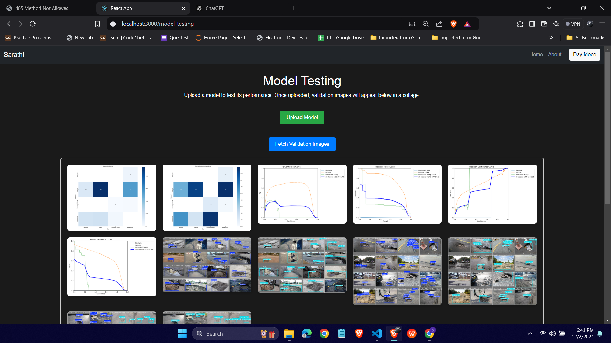
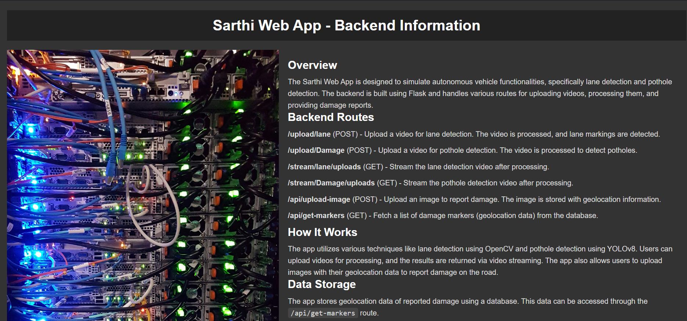

# Sarathi: Real-Time Lane and Road Damage Detection Simulator

## Project Overview

**Sarathi** is a comprehensive simulator designed to enhance autonomous vehicle technologies by integrating real-time lane detection and road damage detection functionalities. The system leverages computer vision and deep learning techniques to provide an efficient and robust platform for improving road safety and navigation.

## Key Features

- **Real-Time Lane Detection**:
  - Utilizes traditional computer vision techniques such as Canny edge detection and Hough Line Transform.
  - Ensures accurate identification of lane boundaries under diverse road conditions.
  - Provides visual feedback by superimposing detected lanes on uploaded video frames.

- **Road Damage Detection**:
  - Employs the YOLOv8 deep learning model for detecting potholes and road hazards.
  - Capable of processing video frames in real time, ensuring prompt identification of hazards.
  - Offers high precision and recall rates for various road conditions.

- **Damage Reporting**:
  - Allows users to upload geotagged images of road damage.
  - Stores metadata in Firebase, facilitating centralized monitoring and visualization on an interactive map.
  - Helps authorities prioritize road maintenance and repairs effectively.

- **Model Testing Platform**:
  - Provides researchers the ability to test and evaluate their custom models for lane and road damage detection.
  - Outputs evaluation metrics to facilitate model comparison and innovation.

## Technical Stack

- **Frontend**:
  - Built using React for a dynamic and user-friendly interface.
  - Features include video upload, real-time result display, and interactive controls for improved usability.

- **Backend**:
  - Developed with Flask to handle video processing, API endpoints, and communication with machine learning models.
  - Supports real-time streaming of processed video frames to the frontend.

- **Machine Learning Models**:
  - **YOLOv8** for road damage detection: High-speed, high-accuracy object detection model.
  - **Canny Edge Detection and Hough Line Transform** for lane detection: Reliable and efficient computer vision techniques.

- **Cloud Storage**:
  - Firebase for storing processed data, geotagged images, and associated metadata.
  - Enables real-time synchronization and secure access for users.

## Impact and Applications

- **Enhanced Road Safety**:
  - Real-time detection minimizes risks by identifying hazards and guiding autonomous vehicles.

- **Proactive Infrastructure Maintenance**:
  - Geotagged damage reports enable authorities to address road maintenance needs effectively.

- **Innovation Platform**:
  - Offers a testable environment for researchers to develop and benchmark new models in autonomous driving.

- **Scalability**:
  - Designed to adapt to broader smart transportation applications.

# Sarathi: Real-Time Lane and Road Damage Detection Simulator

## App Interface

### 1. Home Page

### 2. Lane Detection Feature

### 3. Road Damage Detection Feature

### 4. Lane and Damage Camera View

### 5. Report Damage

### 6. Model Testing

### 7. Backend Processing

